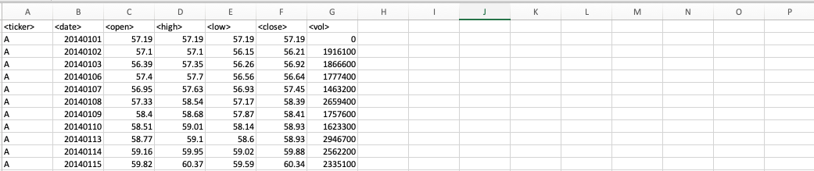

# VBA-challenge

This project uses a VBA script to analyze stock market data. It goes through each sheet in an excel doc containing stock data and outputs the following information:

* The ticker symbol.
* Yearly change from opening price at the beginning of a given year to the closing price at the end of that year.
* The percent change from opening price at the beginning of a given year to the closing price at the end of that year.
* The total stock volume of the stock.

It also provides some conditional formatting that will highlight positive changes in green and negative changes in red.

## Excel Document Format

Each sheet in the excel document is expected in the following format:

The columns below should exist in each sheet in columns A to G:

* ticker
* date
* open
* high
* low
* close
* volume

Note the exact titles of the columns are not required, but just that a header row is expected with the data expected below. Also the `ticker` data is expected in alphabetical order to save time processing.

## Usage

1. Copy and paste the contents of GenerateStockInfo.vba into `ThisWorkbook` in the VBAProjects for the excel document that you are processing.
2. Run the script by clicking the play button and running `ThisWorkbook.GenerateStockInformation`

## Sample Results

Sample results can be found in images/results for:

* [2014](./images/results/2014.jpg)
* [2015](./images/results/2015.jpg)
* [2016](./images/results/2016.jpg)

Note due to limitations in exporting images from excel only the first 512 lines appear in the screenshots. 

## References

TBD
